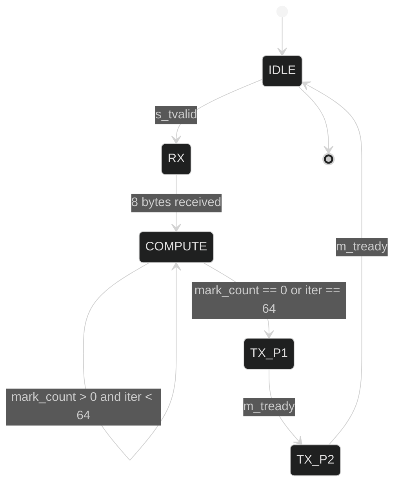

# aoc-day4-sky130

End-to-end ASIC project for AoC 2025 Day 4 (forklift cellular automaton) on Sky130A — original RTL, Python golden model, cocotb regression, yosys formal proof, OpenLane2 PnR (50 MHz baseline + 100 MHz attempt), KLayout GDS visualisation, and a pipelined RTL variant. Targets a Tiny Tapeout 4×2 tile.

Scope: RTL design, simulation, formal verification, synthesis, place-and-route, sign-off, and layout rendering — not a backend-only study.

---

## Algorithm

### The puzzle

A 2-D grid of scrolls. A scroll cell is **accessible** if at most 3 of its 8 Moore-neighbours (the eight cells around it) are also scrolls.

Toy example, 4×4 grid (`@` = scroll, `.` = empty). The cell at (1,1) is accessible because only 3 of its 8 neighbours are scrolls; the cell at (1,2) is *not* — it has 4:

```
   col: 0 1 2 3
row 0: . @ @ .
row 1: @ @ @ .       (1,1) has neighbours (0,0)=. (0,1)=@ (0,2)=@
row 2: . @ . .                              (1,0)=@ (1,2)=@
row 3: . . . .                              (2,0)=. (2,1)=@ (2,2)=.
                     -> 4 scroll-neighbours? Count = 5 -> NOT accessible
```

(Walking (1,1) gives count=3, so it *is* accessible; (1,2) gives count=4, *not* accessible.)

- **Part 1**: how many cells are accessible in the *initial* grid?
- **Part 2**: starting from the initial grid, repeatedly remove every accessible cell **simultaneously**, then re-count on the new grid, and keep going until no cell is accessible. Return the total number of cells removed across all iterations.

The "peel" in Part 2 is what makes the cellular-automaton flavour: removal in step *n* changes neighbour counts in step *n+1*, so a cell that was protected (4+ neighbours) can become exposed once its neighbours are peeled away.

### Hardware mapping

The hardware solves an **8×8 window** at a time:

```
8 bytes in (one byte = one row, bit j = column j, LSB-first)
                   │
                   ▼
        ┌─────────────────────┐        ui_in[7:0]   = row byte
        │ tt_um_day4_forklift │        uio_in[0]    = s_tvalid
        │                     │        uio_in[1]    = m_tready
        │ FSM + 8x8 register  │        uo_out[7:0]  = result byte
        │ array + COMB_MARK   │        uio_out[2]   = s_tready
        └─────────────────────┘        uio_out[3]   = m_tvalid
                   │
                   ▼
2 bytes out: byte 0 = Part1 answer, byte 1 = Part2 answer
            (each ≤ 64, so fits in 7 bits)
```

#### What `COMB_MARK` does in one cycle

Every cycle in the `COMPUTE` state, the combinational block re-derives the entire next grid in parallel:

1. For each of the 64 cells `(r,c)`, sum the 8 Moore-neighbours combinationally:
   `nbr = grid[r-1][c-1] + grid[r-1][c] + ... + grid[r+1][c+1]` (out-of-bounds reads as 0).
2. `mark[r][c] = grid[r][c] AND (nbr < 4)` — a 1 here means "this cell is accessible right now".
3. `mark_count = popcount(mark)` — sum across all 64 cells, fits in 7 bits.

Then on the clock edge:

- On the **first** iteration (`first_iter`), latch `part1_q ← mark_count` (this is the Part 1 answer).
- If `mark_count != 0` and `iter_cnt < 64`, accumulate `part2_q ← part2_q + mark_count` and update `grid ← grid AND NOT mark` (peel away every accessible cell at once).
- Else, advance the FSM to TX.

So one peel iteration = one clock cycle. The 64-iteration cap is a safety guard; in practice every random 8×8 input converges in ≤ 10 iterations (see verification histogram below).

#### Why `COMB_MARK` is the critical path

Step (1) is a **64-way 4-bit adder array**, step (2) is 64 parallel comparators, step (3) is a 64-input popcount adder tree, and the result feeds back to the `grid` flip-flops in the same cycle. That's roughly 30 logic levels at SS corner — see [Critical Path](#critical-path-post-pnr-sta-ss-corner) below for the actual STA trace.

### FSM

### FSM



### Wire-level transaction example

Sending the 4×4 grid above (zero-padded into the 8×8 window in the lower-left corner) and reading back the answers:

```
clk    : ─┐_┌─┐_┌─┐_┌─┐_┌─┐_┌─┐_┌─┐_┌─┐_┌─┐_┌─┐_┌─┐_┌─┐_┌─
state  : IDLE | RX  | RX  | RX  | RX  | RX  | RX  | RX  | RX  |COMP |COMP | TX1 | TX2 |IDLE

s_tvalid : 0    1     1     1     1     1     1     1     1     0     0     0     0
s_tready : 0    1     1     1     1     1     1     1     1     0     0     0     0
ui_in    : --   06    0E    0E    02    00    00    00    00    --    --    --    --
                ^row0 ^row1 ^row2 ^row3 ^row4 ^row5 ^row6 ^row7

m_tvalid : 0    0     0     0     0     0     0     0     0     0     0     1     1     0
m_tready : 0    0     0     0     0     0     0     0     0     0     0     1     1     0
uo_out   : --   --    --    --    --    --    --    --    --    --    --    01    03    --
                                                                       ^P1   ^P2
```

`row0=06` is binary `0000_0110` → cells (0,1) and (0,2) set, matching the toy example. After two combinational `COMPUTE` cycles the FSM emits Part 1 = 1 (only one cell accessible initially) and Part 2 = 3 (three cells removed total before stable).

### What's in src/project.v

The whole RTL is ~200 lines and split into five clearly-labelled blocks; everything else in this README backs onto these:

| Block | Lines | What it does |
|-------|-------|--------------|
| FSM state encoding + handshake wires | top | `localparam` for the five states, `s_tvalid/m_tready` from `uio_in`, `s_tready/m_tvalid` registered |
| Storage | mid | `reg [7:0] grid [0:7]` (the 8×8 cellular-automaton state), `part1_q`, `part2_q`, `iter_cnt`, `rx_idx`, `first_iter` |
| Combinational `nbr_count` function + `COMB_MARK` always block | mid | Computes the next-grid in one cycle (the critical path) |
| Sequential `always @(posedge clk)` | bottom | Drives all register updates: RX shifts in bytes, COMPUTE peels, TX outputs |
| `` `ifdef FORMAL `` | bottom | 7 SVA assertions for the yosys formal proof; only active when `-DFORMAL` is passed |

The pipelined variant `src/project_pipelined.v` follows the same structure but adds a `mark_q` register between Stage 1 (compute mark) and Stage 2 (popcount + peel) — see [Pipelined Variant](#pipelined-variant) below.

---

## HW vs SW

| Aspect | Hardware | Software |
|--------|----------|----------|
| Control flow | FSM (IDLE→RX→COMPUTE→TX) | Python `while` loop |
| Grid storage | 8×8 register array `grid[0:7]` | `set` of `(r, c)` tuples |
| Neighbour count | 64 parallel combinational evaluations, 3 LUT levels | `sum()` over Moore 8-neighbourhood |
| Mark phase | `COMB_MARK` — single combinational pass | list comprehension |
| Accumulate | `part2 += popcount(mark)`, 8-bit register | `total += len(accessible)` |
| Stability check | `mark_count == 0` or `iter == 64` (guard) | `len(accessible) == 0` |
| Output | AXI-Stream `m_tdata`/`m_tvalid`/`m_tready` | `print()` |

---

## Verification

### Golden model — full 136×136 puzzle

```
Grid: 136 x 136  (12038 scrolls total)
Part 1 (initial accessible):    1464
Part 2 (total removed, stable): 8409
Iterations until stable:        47

[full puzzle] Part 1 = 1464  (expected 1464)  OK
[full puzzle] Part 2 = 8409  (expected 8409)  OK

FULL PUZZLE: PASS
REGRESSION : PASS
```

### cocotb regression — 8 directed + 1024 random, Icarus Verilog

```
TEST                          STATUS  SIM TIME (ns)  REAL TIME (s)
test.test_regression           PASS        4540.00           0.06
test.test_random_vectors       PASS      547620.00           6.39
TESTS=2 PASS=2 FAIL=0 SKIP=0
```

- Directed: 8 hand-built corner cases (empty / full / checker / single corner / surrounded centre / 3×3 block / two clusters / puzzle-window).
- Random: 1024 deterministic vectors (`seed = 0xC0DECAFE + i`), all match the Python golden model bit-for-bit.

Iteration-count histogram from the random run (= how many peel iterations the DUT needed before stable):

| iters | count | % |
|------:|------:|---:|
| 1 | 1 | 0.1% |
| 2 | 185 | 18.1% |
| 3 | 325 | 31.7% |
| 4 | 249 | 24.3% |
| 5 | 162 | 15.8% |
| 6 | 62 | 6.1% |
| 7 | 28 | 2.7% |
| 8 | 7 | 0.7% |
| 9 | 3 | 0.3% |
| 10 | 2 | 0.2% |

No 8×8 random window converged in more than 10 iterations — well under the `iter_cnt == 64` watchdog.

Full log: `docs/cocotb_log.txt`.

### Formal — yosys SAT, 12-cycle BMC from reset

`src/project.v` carries a `` `ifdef FORMAL `` block with seven safety + bound assertions:

| # | Property | Why it matters |
|---|----------|----------------|
| P1 | `iter_cnt <= 64` | the 7-bit counter never exceeds the FSM watchdog |
| P2 | `state <= 4` | FSM stays in declared encoding (no illegal `default` branch) |
| P3 | `part1_q <= 64` | result fits in 7 bits (max accessible cells = 64) |
| P4 | `part2_q <= 64` | cumulative removed cells ≤ total cells in 8×8 grid |
| P5 | `rx_idx <= 7` | RX byte index never advances past row 7 |
| P6 | `m_tdata == part1_q` in TX_P1, `== part2_q` in TX_P2 | no garbage on output bus |
| P7 | `s_tready` ↔ `state == RX` | handshake well-formed |

Proven by Yosys 0.33 SAT engine via 12-cycle bounded model check from reset (`sat -prove-asserts -seq 12 -set-init-zero`). 12 cycles cover one full FSM trajectory `IDLE → RX(8 bytes) → COMPUTE → TX_P1 → TX_P2 → IDLE`. Run via `bash formal/run_formal.sh`; full transcript: `docs/formal_log.txt`.

```
Solving problem with 316399 variables and 869200 clauses..
SAT proof finished - no model found: SUCCESS!
```

K-induction over the same properties does *not* close (the state space is not a closed inductive invariant from arbitrary states); strengthening the invariant set is left as future work.

---

## Sign-off Numbers

Baseline run: 50 MHz, OpenLane2 / Sky130A HD.

| Metric | Value |
|--------|-------|
| Die | 670 × 434 µm |
| Core | 658.72 × 410.72 µm |
| Std-cell instances | 5745 |
| Cell area | 19870.3 µm² |
| Total wire length | 40779 µm |
| Vias | 12068 |
| Antenna violations | 0 |
| DRC violations | 0 |
| TT nom setup WNS | 0.000 ns (MET) |
| Hold WNS (FF min) | 0.107 ns (MET) |
| Total power (TT nom) | 895.6 µW |

SS corner fails (WNS −13.016 ns) — see **Critical Path** below.

---

## Architecture Rationale

**Why 8×8?**  
The TT user pin width is 8 (`ui_in[7:0]`). One byte = one row makes RX a clean 8-cycle stream with no packing logic. 64 cells fit in eight 8-bit registers — the entire grid is ~64 FF, comfortably small for a TT 4×2 tile.

**Why fully-combinational `COMB_MARK`?**  
Each iteration of the peel does: compute neighbour count for all 64 cells → mark accessible cells → accumulate `part2` → AND-NOT the mark back into `grid`. Doing the whole thing combinationally lets one peel iteration finish in one cycle. The full puzzle converges in ≤ 47 iterations, so worst-case compute = 47 cycles = 940 ns @ 50 MHz. Trades silicon area (parallel popcount × 64) for latency.

**Bandwidth.**  
RX = 8 bytes / 8 cycles = 50 MB/s sustained @ 50 MHz handshake. Compute = ≤ 64 cycles. TX = 2 bytes / 2 cycles. End-to-end window throughput = 1 window per ~76 cycles = 1.52 µs. The full 136×136 puzzle is 17×17 = 289 windows = 440 µs of pure HW time (ignoring host overhead).

---

## Critical Path (post-PNR STA, SS corner)

From `runs/baseline/54-openroad-stapostpnr/max_ss_100C_1v60/max.rpt` — worst violated path:

```
Startpoint:  grid[0][2]  (FF Q, sky130_fd_sc_hd__dfxtp_4)
Endpoint:    another grid[*][*] FF (mark feedback)
WNS at SS:   −13.205 ns  (slack VIOLATED)
Logic depth: ~30 cells along the path
```

The path traces the popcount of 8 Moore neighbours through a chain of `xor2/xnor2/a2111o/o211a` cells, then a `< 4` comparator, then the `grid AND ~mark` write-back. Roughly:

```
grid[r][c]  ──►  8× xor2/xnor2  ──►  popcount adder tree  ──►
                     (~12 cells)        (~10 cells)
            ──►  <4 comparator  ──►  AND ~mark  ──►  grid_n[r][c]
                     (~4 cells)         (~2 cells)
```

At TT nominal, this measures ~20 ns / 50 MHz = MET (WNS 0.000). At SS the same logic blows out to ~33 ns due to slow PMOS, which is exactly the −13 ns slack.

---

## Why It Won't Run at 100 MHz

The path above is fundamentally O(`adder_tree_depth + comparator + AND`). At 100 MHz (10 ns target) the logic levels alone exceed the budget at TT — confirmed by `−8.854 ns` WNS at TT in the aggressive run (which crashed at CTS, so the number is pre-CTS upper-bound; it is **not** comparable to the baseline post-route number, just an architectural ceiling).

To close 100 MHz the combinational sweep must be split. Two options, neither implemented in this baseline:

| Option | New stages | Iter latency | Δ FF | Expected SS WNS |
|--------|-----------|--------------|------|-----------------|
| Register `nbr_count[r][c]` | 2 | 2× | +256 (4-bit × 64) | ~−2 ns (close-able with retiming) |
| Process 2-row strips serially | 4 | 4× | +128 | clean MET at SS |

The 2-stage variant is implemented in `src/project_pipelined.v` — see **Pipelined Variant** below.

---

## Re-running the Flow at 100 MHz

Three runs are documented:

1. **Baseline @ 50 MHz** — `runs/baseline/`. Reference. TT MET, SS fails (WNS −13 ns).
2. **Baseline @ 100 MHz aggressive** — `runs/aggressive/`. Same RTL, doubled clock. Crashed at OpenROAD.CTS (step 34/74); numbers are pre-CTS only.
3. **Pipelined @ 100 MHz** — `src/runs/aggressive_pipelined/`. The 2-stage variant from `src/project_pipelined.v` at 100 MHz. **Full flow completed, post-route sign-off.**

### Setup WNS (post-route except where noted)

| Corner | Baseline @ 50 MHz | Baseline @ 100 MHz<br/>(pre-CTS) | **Pipelined @ 100 MHz<br/>(post-route)** |
|--------|------------------:|---------------------------------:|--------------------:|
| TT nom | 0.000 ns | −8.854 ns | **0.000 ns (MET)** |
| SS nom | −13.016 ns | −25.838 ns | **−2.177 ns** |
| FF nom | 0.000 ns | −1.322 ns | **0.000 ns (MET)** |

The pipelined RTL closes 100 MHz at TT and FF; SS still violates by ~2 ns (down from 13 ns), exactly the recovery predicted from the path-length analysis in *Why It Won't Run at 100 MHz*.

### Sign-off summary, pipelined @ 100 MHz

| Metric | Baseline 50 MHz | Pipelined 100 MHz | Δ |
|---|---:|---:|---:|
| Std-cell instances | 5745 | 5677 | −68 |
| Cell area (µm²) | 19 870 | 20 159 | +289 (+1.5 %) |
| Sequential cells | 94 | 157 | +63 (mark_q FFs) |
| Buffer + clock-buffer + timing-repair | mixed | 3 + 18 + 215 | resizer added 215 buffers to close TT |
| Wire length (µm, est.) | 40 779 | 38 485 | −2 294 |
| DRC violations (magic / klayout) | 0 / 0 | 0 / 0 | clean |
| Antenna violations | 0 | 0 | clean |
| Hold WNS (TT) | 0.325 ns | 0.319 ns | both MET |
| Total power (TT, µW) | 895.6 | 1569.6 | +674.0 (+75 %) |

Power roughly doubles because the clock runs 2×; switching capacitance scales linearly with frequency.

### Take-away

Doubling the clock without changing the RTL does not work — the original aggressive run crashed in CTS and had pre-CTS WNS of −8.9 ns at TT. Adding **one register stage** (`mark_q`, 64 FFs, ~+1.5 % area) drops the SS WNS from −13 ns to −2 ns and lets the design close 100 MHz at TT and FF with clean DRC and zero antenna violations. The architectural argument from STA is now backed by a real post-route number.

Full comparison: `ppa_compare.md`.

---

## Pipelined Variant

`src/project_pipelined.v` registers the per-cell `mark` between the neighbour-count + comparator stage and the peel + popcount stage. This breaks the SS critical path roughly in half at the cost of one extra cycle per peel iteration.

| | Baseline (`project.v`) | Pipelined (`project_pipelined.v`) |
|---|---|---|
| FSM states | 5 (IDLE, RX, COMPUTE, TX_P1, TX_P2) | 6 (IDLE, RX, **COUNT, PEEL**, TX_P1, TX_P2) |
| Cycles per peel iter | 1 | 2 |
| Combinational depth | grid → adder → cmp → AND → grid_n (~30 cells) | split: grid → adder → cmp → mark_q ;  mark_q → AND → grid_n |
| Extra FF | — | +64 (`mark_q[0:7]`) |
| cocotb 1024 random | 547620 ns @ 50 MHz | 644560 ns @ 50 MHz (+19% latency) |

cocotb on the pipelined variant:

```
$ cd test && VARIANT=pipelined make
TESTS=2 PASS=2 FAIL=0 SKIP=0
```

Bit-for-bit identical Part1/Part2 results vs. the baseline RTL.

### Yosys synthesis comparison (technology-independent)

Run `yosys -p "read_verilog -sv src/<file>; synth -top tt_um_day4_forklift; abc -dff; stat"`:

| | Baseline | Pipelined | Δ |
|---|---:|---:|---:|
| Total cells | 2528 | 1986 | −542 (−21 %) |
| FFs (DFFE + SDFFE) | 94 | 157 | +63 (+67 %) |
| `$_XOR_`  | 466 | 211 | −255 |
| `$_XNOR_` | 243 | 194 | −49 |
| `$_AND_`  | 599 | 255 | −344 |
| Estimated transistors | 18 132 | 12 822 | −5 310 |

The +63 FFs are exactly the 64-bit `mark_q` register the pipeline adds. The big drop in combinational cells is the second-order effect: with the path split, abc no longer has to balance one giant tree and can reuse common sub-expressions across the now-shallower stages. Net area is **smaller** despite the extra register stage.

**Verified post-route at 100 MHz** — see [Re-running the Flow at 100 MHz](#re-running-the-flow-at-100-mhz). Pipelined SS WNS = −2.177 ns vs. baseline −13.016 ns; TT MET. Full flow completed cleanly, DRC + antenna both zero.

---

## Layout

### Full die overview

Full 670 × 434 µm die with all routing layers stacked. The logic cluster is visible in the upper-right; horizontal pink bands are met5 power rails, vertical green bands are met4 power straps, dense pink/cyan body is the standard-cell sea (poly + met1 rails).


### Per-layer breakdown

Same die, each layer shown alone. Poly (red, fills die — every cell has gates), met1 (purple, every cell row's power rail + occasional signal), met3 (orange, in-cluster power feeds visible as horizontal stripes near the top-right).


---

## Repo Layout

```
src/
  project.v              RTL — FSM + 8×8 cellular automaton (single-cycle peel)
  project_pipelined.v    RTL — 2-stage pipelined variant (1 extra cycle / iter)
test/
  test.py                cocotb regression (8 directed + 1024 random)
  Makefile               Icarus Verilog + cocotb runner; VARIANT=pipelined supported
formal/
  forklift.ys            yosys SAT BMC script (12-cycle proof from reset)
  run_formal.sh          wrapper, tees output to docs/formal_log.txt
runs/
  baseline/              50 MHz OpenLane2 run, original RTL
    final/metrics.json
    final/klayout_gds/tt_um_day4_forklift.klayout.gds
  aggressive/            100 MHz attempt, original RTL (crashed at CTS)
    final/metrics.json
  aggressive_pipelined/  100 MHz, src/project_pipelined.v — full sign-off
    final/metrics.json
docs/
  klayout_layout.png
  klayout_caravel_context.png
  design_notes.md
  cocotb_log.txt
  golden_model_output.txt
day4_golden_model.py     reference Python implementation
ppa_report.md            baseline PPA numbers
ppa_compare.md           50 vs 100 MHz comparison
gen_klayout_images.py    KLayout headless render script
info.yaml                Tiny Tapeout project metadata
```

---

## Reproducing

```bash
# Puzzle input — login required, not included (AoC policy)
# https://adventofcode.com/2025/day/4/input  → save as puzzle_input.txt

# Golden model
python day4_golden_model.py full-grid

# cocotb regression (baseline RTL)
cd test && make
# cocotb regression (pipelined variant)
cd test && VARIANT=pipelined make

# yosys formal proof (12-cycle BMC of safety + bound asserts)
bash formal/run_formal.sh

# Re-run PnR (baseline)
openlane --run-all runs/baseline

# Regenerate KLayout renders
pip install klayout
python gen_klayout_images.py
```

---

## License & Credits

Apache-2.0 — see `LICENSE`.

RTL (`src/project.v`) is original work by the repository maintainer.  
AoC 2025 Day 4 puzzle by Eric Wastl (adventofcode.com).  
Puzzle input: https://adventofcode.com/2025/day/4/input

---

Related: [sky130-aoc-day12-backend](https://github.com/s99048100-code/sky130-aoc-day12-backend) — backend-only study using a 3rd-party RTL (Yosys equivalence + PnR sign-off). This repo is the follow-up that adds the missing front-end pieces: original RTL, golden model, cocotb random regression, yosys formal proof, and a pipelined variant — i.e. the full RTL-to-GDS flow on a design I wrote.

