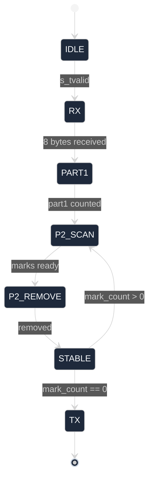

# sky130-aoc-day4-backend

AoC 2025 Day 4 forklift cellular automaton — original RTL, Sky130A / Tiny Tapeout 4×2 tile, OpenLane2 PnR, cocotb verified, KLayout GDS render.

---

## Algorithm

**Puzzle input** — a 2-D grid of scroll characters.  
A scroll is *accessible* if it has fewer than 4 occupied Moore-neighbours.

- **Part 1**: count accessible scrolls on the initial grid.  
- **Part 2**: peel accessible scrolls iteratively until the grid is stable; return total removed.

Hardware receives the 8×8 window as 8 bytes over AXI-Stream (one byte = one row, MSB = column 0). It computes both answers and returns them as 2 bytes (Part 1, then Part 2) on the same AXI-Stream interface.

```
s_tvalid/s_tdata  ──►  [tt_um_day4_forklift]  ──►  m_tvalid/m_tdata
    8 bytes (grid)                                     2 bytes (answers)
```

### FSM



---

## HW vs SW

| Aspect | Hardware | Software |
|--------|----------|----------|
| Control flow | FSM (IDLE→RX→COMPUTE→TX) | Python `while` loop |
| Grid storage | 8×8 register array `grid[0:7]` | `set` of `(r, c)` tuples |
| Neighbour count | 64 parallel combinational evaluations, 3 LUT levels | `sum()` over Moore 8-neighbourhood |
| Mark phase | `COMB_MARK` — single combinational pass | list comprehension |
| Accumulate | `part2 += popcount(mark)`, 8-bit register | `total += len(accessible)` |
| Stability check | `mark_count == 0` or `iter == 64` (guard) | `len(accessible) == 0` |
| Output | AXI-Stream `m_tdata`/`m_tvalid`/`m_tready` | `print()` |

---

## Verification

### Golden model — full 136×136 puzzle

```
Grid: 136 x 136  (12038 scrolls total)
Part 1 (initial accessible):    1464
Part 2 (total removed, stable): 8409
Iterations until stable:        47

[full puzzle] Part 1 = 1464  (expected 1464)  OK
[full puzzle] Part 2 = 8409  (expected 8409)  OK

FULL PUZZLE: PASS
REGRESSION : PASS
```

### cocotb regression — 8 vectors, Icarus Verilog

All 8 regression vectors pass: `TESTS=1 PASS=1 FAIL=0 SKIP=0`.  
Full log: `docs/cocotb_log.txt`.

---

## Sign-off Numbers

Baseline run: 50 MHz, OpenLane2 / Sky130A HD.

| Metric | Value |
|--------|-------|
| Die | 670 × 434 µm |
| Core | 658.72 × 410.72 µm |
| Std-cell instances | 5745 |
| Cell area | 19870.3 µm² |
| Total wire length | 40779 µm |
| Vias | 12068 |
| Antenna violations | 0 |
| DRC violations | 0 |
| TT nom setup WNS | 0.000 ns (MET) |
| Hold WNS (FF min) | 0.107 ns (MET) |
| Total power (TT nom) | 895.6 µW |

SS corner fails (WNS −13.016 ns) — the `COMB_MARK` 64-cell combinational sweep is the critical path (~7–9 LUT levels). Pipelining the mark accumulator would recover the SS corner.

---

## Re-running the Flow at 100 MHz

Flow crashed at OpenROAD.CTS (step 34/~60). Numbers are post-global-placement, pre-CTS.

| Corner | Baseline WNS (50 MHz) | Aggressive WNS (100 MHz) |
|--------|-----------------------|--------------------------|
| TT nom | 0.000 ns | −8.854 ns |
| SS nom | −13.016 ns | −25.838 ns |
| FF nom | 0.000 ns | −1.322 ns |

| Component | Baseline (µW) | Aggressive (µW) | Delta |
|-----------|--------------|-----------------|-------|
| Internal | 547.4 | 752.0 | +204.5 |
| Switching | 348.2 | 382.8 | +34.6 |
| **Total** | **895.6** | **1134.7** | **+239.1** |

100 MHz does not close at TT nominal. The design cannot run above 50 MHz without architectural changes.

Full comparison: `ppa_compare.md`.

---

## Layout


---

## Repo Layout

```
src/
  project.v              RTL — FSM + 8×8 cellular automaton core
test/
  test.py                cocotb regression (8 vectors)
  Makefile               Icarus Verilog + cocotb runner
runs/
  baseline/              50 MHz OpenLane2 run
    final/metrics.json
    final/klayout_gds/tt_um_day4_forklift.klayout.gds
  aggressive/            100 MHz attempt (partial, crashed at CTS)
    final/metrics.json
docs/
  klayout_layout.png
  klayout_caravel_context.png
  design_notes.md
  cocotb_log.txt
  golden_model_output.txt
day4_golden_model.py     reference Python implementation
ppa_report.md            baseline PPA numbers
ppa_compare.md           50 vs 100 MHz comparison
gen_klayout_images.py    KLayout headless render script
info.yaml                Tiny Tapeout project metadata
```

---

## Reproducing

```bash
# Puzzle input — login required, not included (AoC policy)
# https://adventofcode.com/2025/day/4/input  → save as puzzle_input.txt

# Golden model
python day4_golden_model.py full-grid

# cocotb regression
cd test && make

# Re-run PnR (baseline)
openlane --run-all runs/baseline

# Regenerate KLayout renders
pip install klayout
python gen_klayout_images.py
```

---

## License & Credits

Apache-2.0 — see `LICENSE`.

RTL (`src/project.v`) is original work by the repository maintainer.  
AoC 2025 Day 4 puzzle by Eric Wastl (adventofcode.com).  
Puzzle input: https://adventofcode.com/2025/day/4/input

---

Related: [sky130-aoc-day12-backend](https://github.com/s99048100-code/sky130-aoc-day12-backend) — backend study on an existing RTL; this repo is the follow-up with original RTL.

