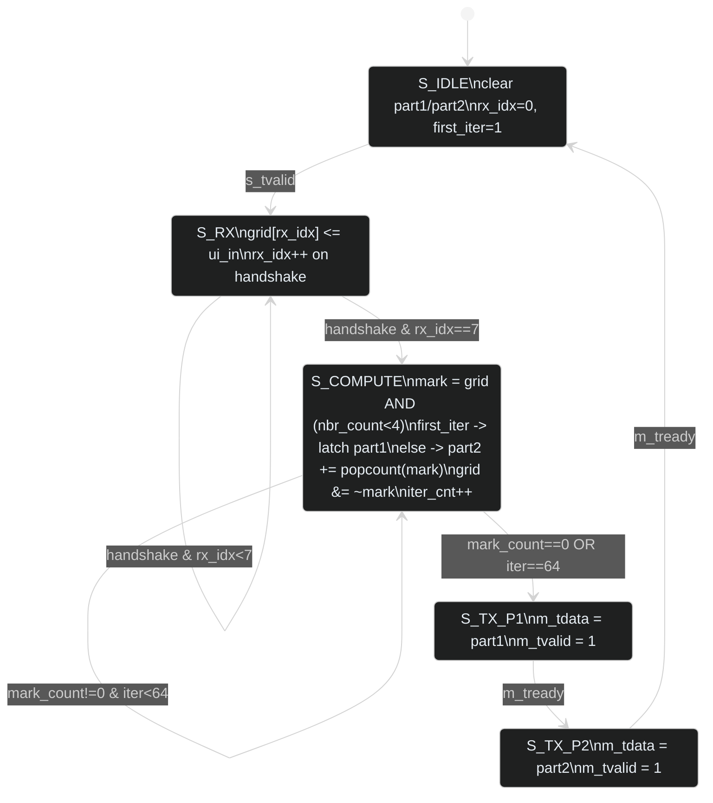
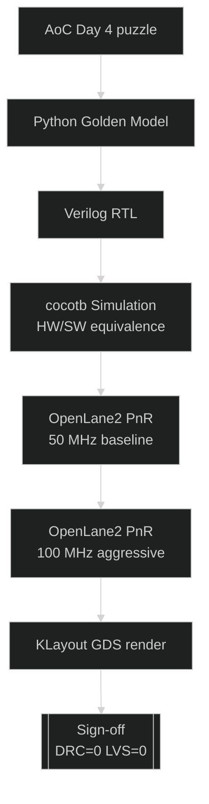

# sky130-aoc-day4-backend

AoC 2025 Day 4 forklift cellular automaton — original RTL, Sky130A / Tiny Tapeout 4×2 tile.
OpenLane2 PnR, cocotb verified, KLayout GDS render.

---

**Attribution**

RTL (`src/project.v`) is original work by the repository maintainer.
AoC 2025 Day 4 puzzle by Eric Wastl (adventofcode.com).
Puzzle input requires login at: https://adventofcode.com/2025/day/4/input

---

## Puzzle — forklift cellular automaton

Grid of scrolls. A scroll is *accessible* if it has fewer than 4 neighbours in the Moore 8-neighbourhood.

- **Part 1**: count accessible scrolls on the initial grid.
- **Part 2**: peel accessible scrolls iteratively until stable; return total removed.

Hardware solves an 8×8 window at 50 MHz. Full 136×136 puzzle converges in 47 iterations.

---

## FSM



---

## Verification

### Golden model

```
Grid: 136 x 136  (12038 scrolls total)
Part 1 (initial accessible):      1464
Part 2 (total removed, stable):   8409
Iterations until stable:          47

[full puzzle] Part 1 = 1464  (expected 1464)  OK
[full puzzle] Part 2 = 8409  (expected 8409)  OK

FULL PUZZLE: PASS
REGRESSION : PASS
```

### cocotb regression (8 cases, Icarus Verilog)

All 8 regression vectors PASS — `TESTS=1 PASS=1 FAIL=0 SKIP=0`.
Full sim log: `docs/cocotb_log.txt`.

---

## HW / SW mapping

| Concept | Python | Verilog |
|---------|--------|---------|
| Grid storage | `set` of `(r,c)` | 8×8 register array `grid[0:7]` |
| Neighbour count | `sum()` over 8 cells | `nbr_count()` combinational, 3 LUT levels |
| Mark phase | list comprehension | `COMB_MARK` — 64 parallel combinational evals |
| Accumulate | `total += len(accessible)` | `part2_q += mark_count` (8-bit) |
| Stability check | `len(accessible) == 0` | `mark_count == 0` or `iter_cnt == 64` (guard) |
| Output | `print` | AXI-Stream: `m_tdata` / `m_tvalid` / `m_tready` |

---

## Sign-off — baseline 50 MHz, OpenLane2 / Sky130A HD

| Metric | Value |
|--------|-------|
| Die | 670 × 434 µm |
| Core | 658.72 × 410.72 µm |
| Std-cell instances | 5745 |
| Cell area | 19870.3 µm² |
| Total wire length | 40779 µm |
| Vias | 12068 |
| Antenna violations | **0** |
| DRC | **0** |
| TT nom setup WNS | 0.000 ns |
| Hold WNS (all corners) | 0.107 ns |
| Total power (TT) | 895.6 µW |

TT nominal 50 MHz closes. SS corner fails (WNS −13.016 ns) — `COMB_MARK` 64-cell sweep is the bottleneck (~7–9 LUT levels). Pipelining the mark accumulator would fix it.

---

## 100 MHz stress test — aggressive run, partial PnR

Flow crashed at OpenROAD.CTS (step 34/~60). Numbers are post-global-placement, pre-CTS.

| Corner | Baseline WNS (50 MHz) | Aggressive WNS (100 MHz) |
|--------|-----------------------|--------------------------|
| TT nom | 0.000 ns | −8.854 ns |
| SS nom | −13.016 ns | −25.838 ns |

100 MHz doesn't close at TT. Full delta in `ppa_compare.md`.

---

## Layout


---

## Development flow



---

## Repo structure

```
src/
  project.v              RTL — FSM + 8×8 cellular automaton core
test/
  test.py                cocotb regression (8 vectors)
  Makefile               Icarus Verilog + cocotb runner
runs/
  baseline/              50 MHz OpenLane2 run
    final/metrics.json
    final/klayout_gds/tt_um_day4_forklift.klayout.gds
  aggressive/            100 MHz attempt (partial)
    final/metrics.json
docs/
  klayout_layout.png
  klayout_caravel_context.png
  design_notes.md
  flow_diagram.md
  fsm_diagram.md
  cocotb_log.txt
  golden_model_output.txt
day4_golden_model.py     reference Python implementation
ppa_report.md            baseline PPA numbers
ppa_compare.md           50 vs 100 MHz comparison
info.yaml                Tiny Tapeout project metadata
```

---

## Reproduce

```bash
# puzzle input — login required, not included (AoC policy)
# https://adventofcode.com/2025/day/4/input  → save as puzzle_input.txt

# golden model
python day4_golden_model.py full-grid

# cocotb regression
cd test && make

# re-run PnR (baseline)
openlane --run-all runs/baseline

# regenerate KLayout renders
pip install klayout
python gen_klayout_images.py
```

---

Related: [sky130-aoc-day12-backend](https://github.com/s99048100-code/sky130-aoc-day12-backend)
— backend study on an existing RTL;
this repo is the follow-up with original RTL.
