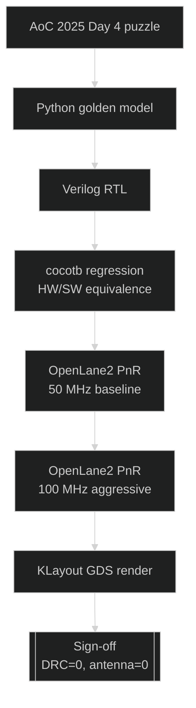

# Development Flow

```mermaid
%%{init: {'theme': 'dark'}}%%
flowchart TD
    A[AoC 2025 Day 4 puzzle] --> B[Python golden model]
    B --> C[Verilog RTL]
    C --> D[cocotb regression<br/>HW/SW equivalence]
    D --> E[OpenLane2 PnR<br/>50 MHz baseline]
    E --> F[OpenLane2 PnR<br/>100 MHz aggressive]
    F --> G[KLayout GDS render]
    G --> H[[Sign-off<br/>DRC=0, antenna=0]]
```
