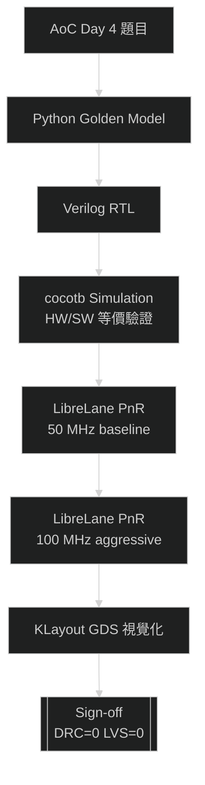

# Development Flow

```mermaid
%%{init: {'theme': 'dark'}}%%
flowchart TD
    A[AoC Day 4 題目] --> B[Python Golden Model]
    B --> C[Verilog RTL]
    C --> D[cocotb Simulation\nHW/SW 等價驗證]
    D --> E[LibreLane PnR\n50 MHz baseline]
    E --> F[LibreLane PnR\n100 MHz aggressive]
    F --> G[KLayout GDS 視覺化]
    G --> H[[Sign-off\nDRC=0 LVS=0]]
```
