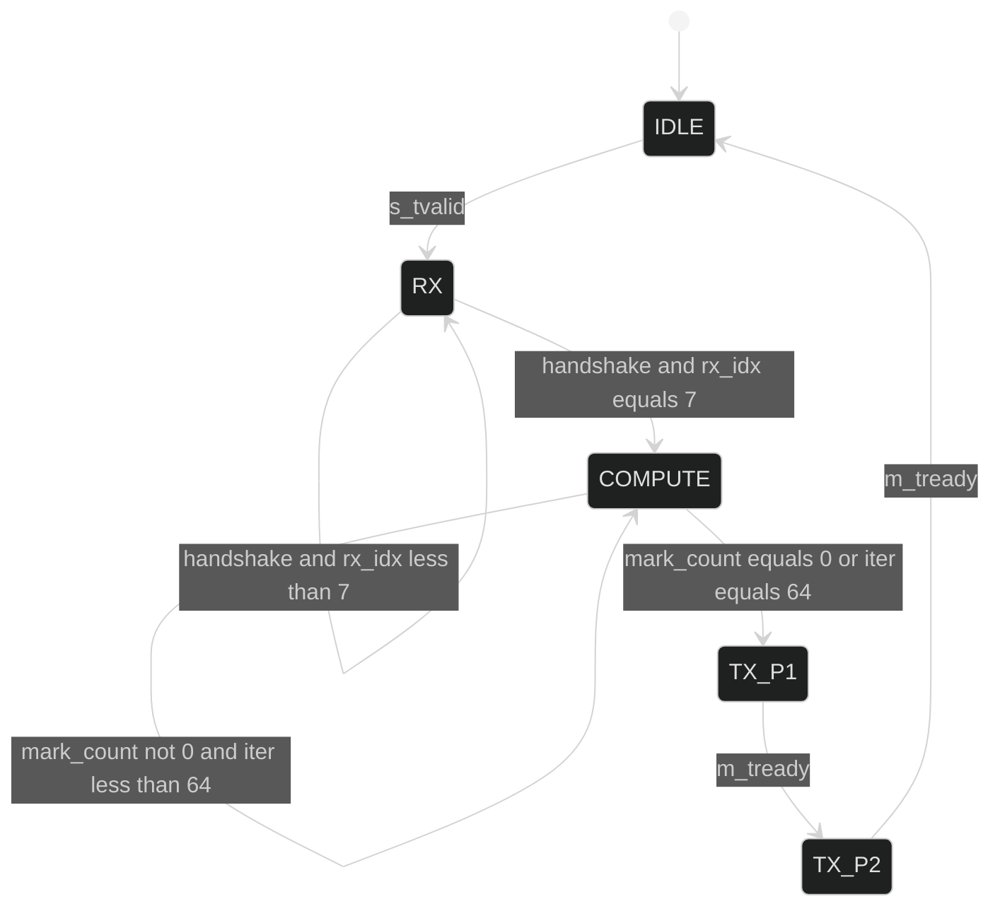

# tt_um_day4_forklift — FSM

## State actions

| State     | What happens |
|-----------|--------------|
| IDLE      | clear part1/part2; rx_idx=0; first_iter=1 |
| RX        | grid[rx_idx] <= ui_in; rx_idx++ on handshake |
| COMPUTE   | mark = grid AND (nbr_count<4); first iter latches part1, else part2 += popcount(mark); grid &= ~mark; iter_cnt++ |
| TX_P1     | m_tdata = part1; m_tvalid = 1; advance on m_tready |
| TX_P2     | m_tdata = part2; m_tvalid = 1; advance on m_tready -> IDLE |

## Cycle budget

| Phase     | Cycles                              | Notes |
|-----------|-------------------------------------|-------|
| RX        | 8 (one per AXI handshake)           | one byte per cycle when master keeps `s_tvalid=1` |
| COMPUTE   | iter+1 (max 65)                     | combinational mark; up to 64 peel iterations + 1 stable check |
| TX_P1     | 1+ (waits for `m_tready`)           | back-pressure aware |
| TX_P2     | 1+ (waits for `m_tready`)           | returns to IDLE |

Worst case at 50 MHz: ~75 cycles ≈ 1.5 µs per 8×8 grid.
