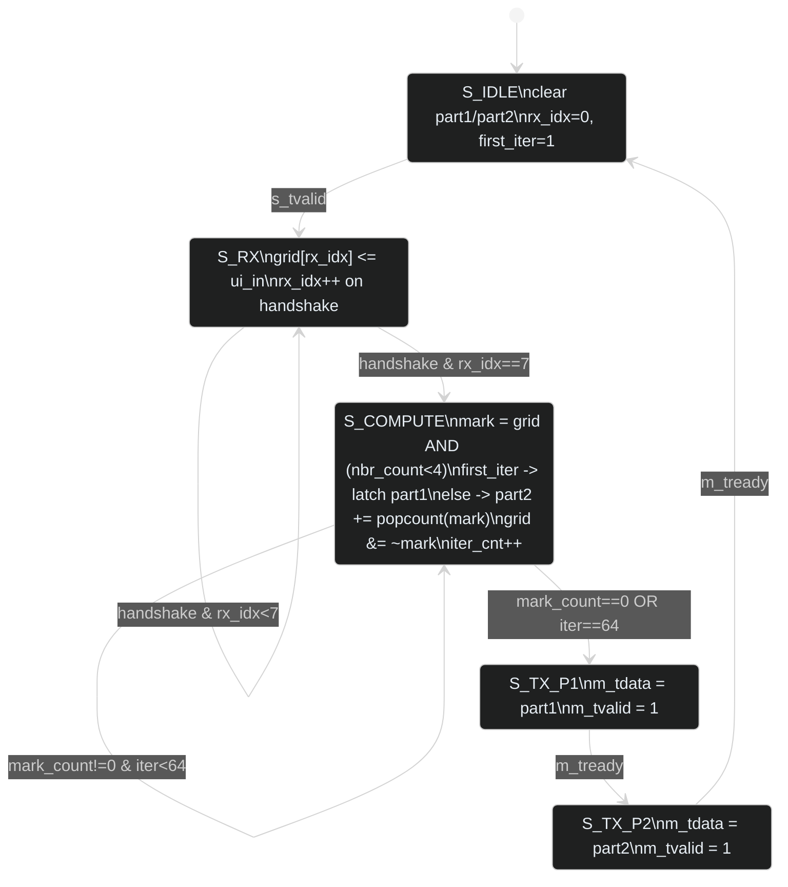

# tt_um_day4_forklift — FSM

## Cycle budget

| Phase     | Cycles                              | Notes |
|-----------|-------------------------------------|-------|
| S_RX      | 8 (one per AXI handshake)           | one byte per cycle when master keeps `s_tvalid=1` |
| S_COMPUTE | iter+1 (max 65)                     | combinational mark; up to 64 peel iterations + 1 stable check |
| S_TX_P1   | 1+ (waits for `m_tready`)           | back-pressure aware |
| S_TX_P2   | 1+ (waits for `m_tready`)           | returns to IDLE |

Worst case at 50 MHz: ~75 cycles ≈ 1.5 µs per 8x8 grid.
